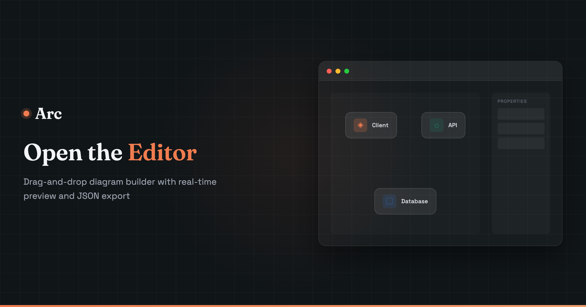

# Arc

A visual diagram editor for creating architecture diagrams. Design visually, export as code.



## Features

- **Visual Editor** - Drag-and-drop nodes, connect with arrows
- **Multiple Node Sizes** - Large, medium, small
- **Color Themes** - Violet, emerald, blue, amber, sky, zinc, rose, orange
- **Connector Styles** - Solid/dashed lines, labels, curved paths
- **Export Options** - TypeScript, JSON, SVG, PNG, shareable links
- **Interactive Canvas** - Infinite pan/zoom, grid snapping
- **Groups & Images** - Visual grouping, background images
- **Templates** - Quick-start layouts

## Getting Started

```bash
pnpm install
pnpm dev
```

## Example Output

Arc exports diagrams as clean TypeScript. Here's a microservices architecture:

```typescript
const diagram: ArcDiagramData = {
  layout: { width: 850, height: 340 },
  nodes: {
    client:  { x: 40,  y: 130, size: 'm' },
    gateway: { x: 220, y: 130, size: 'l' },
    auth:    { x: 460, y: 40,  size: 'm' },
    api:     { x: 460, y: 140, size: 'm' },
    cache:   { x: 460, y: 240, size: 's' },
    db:      { x: 680, y: 140, size: 'm' },
  },
  nodeData: {
    client:  { icon: 'Monitor',  name: 'Client',      subtitle: 'React App', color: 'violet' },
    gateway: { icon: 'Server',   name: 'API Gateway', subtitle: 'Express', description: 'Load balanced', color: 'emerald' },
    auth:    { icon: 'Shield',   name: 'Auth',        subtitle: 'JWT', color: 'amber' },
    api:     { icon: 'Code',     name: 'API',         subtitle: 'REST', color: 'blue' },
    cache:   { icon: 'Zap',      name: 'Cache',       color: 'sky' },
    db:      { icon: 'Database', name: 'PostgreSQL',  subtitle: 'Primary', color: 'blue' },
  },
  connectors: [
    { from: 'client',  to: 'gateway', fromAnchor: 'right',       toAnchor: 'left', style: 'https' },
    { from: 'gateway', to: 'auth',    fromAnchor: 'right',       toAnchor: 'left', style: 'internal' },
    { from: 'gateway', to: 'api',     fromAnchor: 'right',       toAnchor: 'left', style: 'internal' },
    { from: 'gateway', to: 'cache',   fromAnchor: 'bottomRight', toAnchor: 'left', style: 'cache' },
    { from: 'api',     to: 'db',      fromAnchor: 'right',       toAnchor: 'left', style: 'sql' },
  ],
  connectorStyles: {
    https:    { color: 'violet',  strokeWidth: 2, label: 'HTTPS' },
    internal: { color: 'emerald', strokeWidth: 2 },
    cache:    { color: 'sky',     strokeWidth: 1, dashed: true },
    sql:      { color: 'blue',    strokeWidth: 2, label: 'SQL' },
  },
}
```

## Requirements

The `ArcDiagram` player component requires:

- **Tailwind CSS v3+** - Component uses Tailwind utility classes for styling
- **Default color palette** - The following colors must be available: `violet`, `emerald`, `blue`, `amber`, `sky`, `zinc`, `rose`, `orange`

If you're using a custom Tailwind config that restricts the color palette, ensure these colors are included.

## Tech Stack

- React 19
- Vite 7
- TailwindCSS 4
- Lucide React (icons)

## License

MIT
